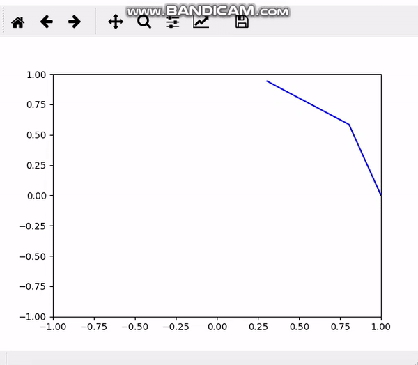
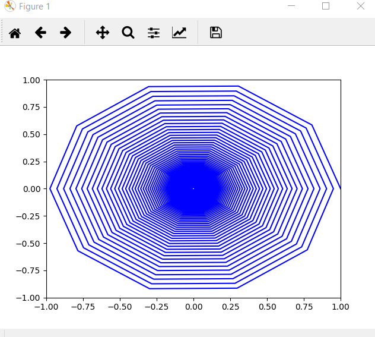

<!--Headline-->
<!--Image-->
<!--UL-->
<!-- URLs-->

# Team Members
## Gehad Mohammed
## Renad Taher
## Reham Abdelfatah
## Nancy Salah

### Trajectory at any point:
Each color in MRI image represents a different material, each material has diffent T1&T2(Relaxation and decay time), we have an image with shape 4by4 which means 16 pixel each pixel represents the value of color that carries, each color value refers to kind of material with different value of T1&T2 according to the B0 value of the external source of magnetic field, so here we will select any point of the phantom that we has then take its T1&T2 values in drawing the trajectory of this point in space.

###  Source Code :
import PIL\
from PIL import Image\
import numpy as np\
from numpy import asarray\
from scipy.ndimage import zoom\
import numpy as np\
import matplotlib.pyplot as plt\
import math\
import time\
import pylab\
import random\ 
import matplotlib.animation\
from matplotlib import animation, rc\
from matplotlib import animation\
from IPython.display import HTML

### Input image is in shape 400x600,(widthxheight).
FILENAME='wvsb.png' #image can be in gif jpeg or png format\ 
#'LA' for grey scale of image 'RGB' for rgb\ 
im=Image.open(FILENAME).convert('LA')\
print (im)
### Converting the opened image into array to read its data.
data = asarray(im)
### Change the size of input photo to get data of phantom 4*4.
data = zoom(data, (0.01, 0.0067, 0.5))\
print('shapenew',data.shape)\
print(type(data))\
print((data.ndim))
### Convert the 3D image into 2D image.
data2 = data.reshape((data.shape[0]), data.shape[1])\

# summarize shape
print('shape',data2.shape)\
print('dim',data2.ndim)\
print(data2[3][0],'data of row 4','size of row 4',data2[3].size)\
#data3=data2.resize((4, 4))\

### Put the data of the input image in array
rows, cols = (4, 4)\
arr=[]\
for i in range (rows):\ 
   for j in range(cols):\
      row = []\
      T1=[]\
      T2=[]\
      row.append((data[i][j]))\
      arr.append(np.concatenate(row))\
### Read the data of each point int the phantom which represents different values of color.
### Each value(color) represents different material in our phantom.
      print(i ,j, data[i][j] )\
arr=np.concatenate(arr)\
### Make a list for color value of each point, then mapping these color values to the corresponding values that they have for T1&T2.
T1=list(arr)\
T2=list(arr)\
for index, item in enumerate(T1):\
### 255 is white color we assumed white color represents the water material.
    if item==255 :
        T1[index] =40000
        T2[index]= 20000
### 0 is black color we assumed black color represents the fat material.
    if item==0 :
        T1[index] = 60000
        T2[index]= 20000
### represents third material by third color.
    if item==78 :
        T1[index] =40000
        T2[index]= 10000
print('T1 for points of our phantom',T1)\
print('T2 for points of our phantom',T2)\
#print(data2)\
print('The array of color value for each point in the phantom shape',asarray(arr).shape)\
print('The array of color value for each point in the phantom size',asarray(arr).size)\
print('The array of color value for each point in the phantom type',asarray(arr).dtype)\
print('The array of color value for each point in the phantom dimension',asarray(arr).ndim)\
print('The array of color value for each point in the phantom length',len(asarray(arr)))

### Applying the drawing of trajectory on our new data.
### Data which comes from the input photo, we select one point from our phantom.
### The variables of this points are T1&T2, They needed in drawing the trajectory for a point from resized photo which represents the phantom in shape(4*4).
### T[0]--> zero index refers the position of selected point, means the point at row=0&col=0, 1--> point at at row=0&col=1 .....2,3,4(represents the index of col at row=0), 5--> point at row=1&col=0.

dT = 100\	
T = 100000\
df = []\
T1 = T1[0]\
T2 = T2[0]\
x=[0,1,2]\
for d in range(len(x)):\
    df.append(3001)\   
N = math.ceil(T/dT)+1\
result=[None]*2\
def freepression(T,T1,T2,df,i):\
 #resultA,B=[],[]\
 for d in range(3):\
  phi = 2*math.pi*df[i]*T/1000\
  Rz = [[math.cos(phi), -math.sin(phi), 0],\
      [math.sin(phi), math.cos(phi) ,0],\
      [0, 0, 1]]\
  E1 = math.exp(-T/T1)\	
  E2 = math.exp(-T/T2)\
  B = [0, 0, 1-E1]\
  A = [[E2, 0, 0],\
       [0 ,E2, 0],\
       [0, 0 ,E1]]\
  resultA = np.dot(A,Rz)\
  return (resultA,B	)

def decay(i):\
  A,B=[],[]\
  A,B= freepression(dT,T1,T2,df,i)\
  M = np.zeros((N,3))\
  M[0,:]= np.array([1,0,0])\
  for k in range (1,N):\
    M[k,:] = np.dot(A,M[k-1,:]) + B\
  return (M)\
M = decay(0)\
print('At T1[0]&T2[0] relates to the first point at row=0,col=0,from phantom 4*4 which represents color refers to one material')\
print('T1[0]&T2[0]--> the first values in our lists to represent data[row=0][col=0] of our phantom of shape(4*4)')\
print('At B0 in mT =',df,'\nFor this strength of MF T1[0]=',T1,' T2[0]=',T2)\
xdata = []\
ydata = []\
timedata = np.arange(N)\
axes = pylab.gca()\
axes.set_xlim(-1,1)\
axes.set_ylim(-1,1)\
line,=axes.plot(xdata,ydata,'b-')\   
pylab.subplot(111)\
for d in range (N):\
    xdata.append(M[d,0])\
    ydata.append(M[d,1])\
    line.set_xdata(xdata)\
    line.set_ydata(ydata)\
    plt.draw()\
    plt.pause(1e-17)\
    time.sleep(0.01)\
fig=plt.show()

### The trajectory which will be shown is of point[at row=0,at col=0](point at 2D has one color represents one material) at space in 3T :
### IF we want to represent another point which may have another color that refers to another material refers to T1 & T2 different in ddrawing the trajectory, we'll use T1[1or2or3......]&T2[1or2or3.....] which represent another point in our phantom by changing the index inside the list of T1 andT2 to call the values of T1&T2 for the selected index which refers to one point in our phantom which has 16 points.

*
