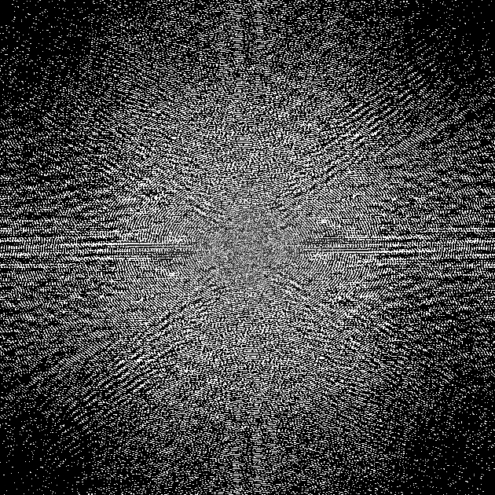
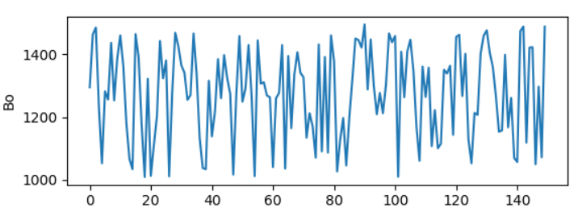
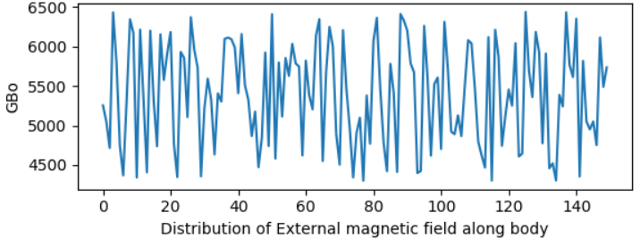
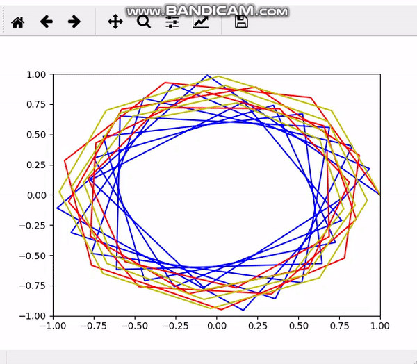
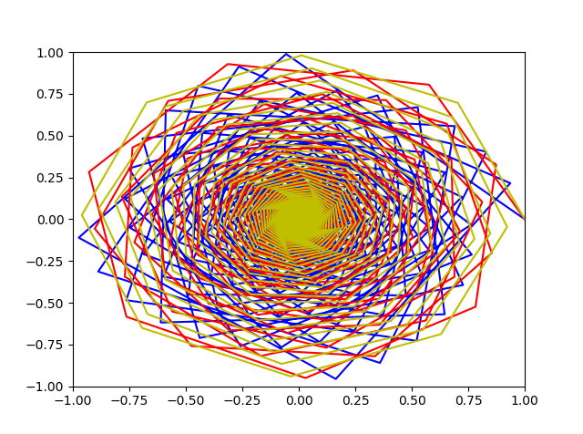

<!--Headline-->
<!--Image-->
<!--UL-->
<!-- URLs-->

# Team Members
## Gehad Mohammed
## Renad Taher
## Reham Abdelfatah
## Nancy Salah

### 1. K-space
*     We convert an image to k-Space. K-space data are equivalent to a Fourier plane. A point close to the centre of k-space contributes a low spatial frequency, represented by a wave with broad peaks and troughs as shown in the resulted figure :

*    Results:

  

*    Source Code :

import matplotlib as plt\
import cv2 as cv\
import numpy as np\
from numpy.fft import fftshift, ifftshift, fftn, ifftn

def transform_image_to_kspace(img, dim=None, k_shape=None):\
    """ Computes the Fourier transform from image space to k-space space\
    along a given or all dimensions\
    :param img: image space data\
    :param dim: vector of dimensions to transform\
    :param k_shape: desired shape of output k-space data\
    :returns: data in k-space (along transformed dimensions)\
    """\
    if not dim:\
        dim = range(img.ndim)

    k = fftshift(fftn(ifftshift(img, axes=dim), s=k_shape, axes=dim), axes=dim)
    k \= np.sqrt(np.prod(np.take(img.shape, dim)))
    return k

image = cv.imread("mri.jpeg",0)\
kspace = transform_image_to_kspace(image)\
kspace = np.asarray(kspace)\
kspace = kspace.astype(np.uint8)\
print(kspace)\
cv.imshow("K-Space",kspace)\
cv.waitKey(0)\
cv.destroyAllWindows()

### 2.a) Description :
*    Upper plot in the following figure represents the effect of External non uniform electromagnetic-field (EMF) along the whole body (which is represented by X _axis), (Y _axis) represents the range of values of EMF (from 1000 m Tesla: 1500 m Tesla) through different points through body due to the non-uniformity effect of External EMF, so not all points along the whole body must have the same effect of External EMF which is represented by upper plot. 

*    Second plot in the same figure represents  the effect of External EMF on water molecules through the whole body( X _axis), (Y _axis) represents the multiplication of gyromagnetic ratio (0.43MH\m T) of hydrogen molecules by External EMF ( 1000m T : 1500 m T), this plot shows that the non-uniformity effect of External EMF on water molecules through human’s body.

*    Results

* 
* 

*    Source Code for 2.a :
 
 
import random\
import matplotlib.pyplot as plt\
import numpy as np\
x = np.arange(0, 150, 1)\
y = []\
for d in range(len(x)):\
     y.append(random.randrange(1000,1500))\
plt.subplot(211)\
plt.ylabel('Bo')\
plt.plot(x, y)\
y2 = []\
for d in range(len(x)):\
    y2.append(random.randrange(43*100,43*150))\
plt.subplot(212)\
plt.ylabel('GBo')\
plt.xlabel('Distribution of External magnetic field along body')\
plt.plot(x, y2)\
plt.show()

###  2.b)  The bulk magnetization's trajectory due to non-uniformly effect of external electromagnetic field

### Results :

### Source Code of 2.b :
import numpy as np\
import matplotlib.pyplot as plt\
import math\
import time\
import pylab\
import random\
dT = 1\	
T = 1000\
df = []\
x=[0,1,2]\
for d in range(len(x)):\
    df.append(random.randrange(1000,1500))\
T1 = 600\
T2 = 100\
N = math.ceil(T/dT)+1\
result=[None]*2\
def freepression(T,T1,T2,df,i):\
 #resultA,B=[],[]\
 for d in range(3):\
  phi = 2*math.pi*df[i]*T/1000\
  Rz = [[math.cos(phi), -math.sin(phi), 0],
      [math.sin(phi), math.cos(phi) ,0],
      [0, 0, 1]]\
  E1 = math.exp(-T/T1)\	
  E2 = math.exp(-T/T2)\
  B = [0, 0, 1-E1]\
  A = [[E2, 0, 0],
       [0 ,E2, 0],
       [0, 0 ,E1]]\
  resultA = np.dot(A,Rz)\
 
  return (resultA,B)\
def decay(i):\
  A,B=[],[]\
  A,B= freepression(dT,T1,T2,df,i)\
  M = np.zeros((N,3))\
  M[0,:]= np.array([1,0,0])\
  for k in range (1,N):\
    M[k,:] = np.dot(A,M[k-1,:]) + B\
  return (M)\
M = decay(0)\
G=  decay(1)\
H=  decay(2)\
#print (i)\
xdata = []\
ydata = []\
timedata = np.arange(N)\
axes = pylab.gca()\
axes.set_xlim(-1,1)\
axes.set_ylim(-1,1)\
line,=axes.plot(xdata,ydata,'b-')\
xdata2 = []\
ydata2 = []\
timedata2 = np.arange(N)\
axes2 = pylab.gca()\
axes2.set_xlim(-1,1)\
axes2.set_ylim(-1,1)\
line2,=axes2.plot(xdata2,ydata2,'r-')\
xdata3 = []\
ydata3 = []\
timedata3 = np.arange(N)\
axes3 = pylab.gca()\
axes3.set_xlim(-1,1)\
axes3.set_ylim(-1,1)\
line3,=axes3.plot(xdata3,ydata3,'y-')\
pylab.subplot(111)\
for d in range (N):\
    xdata.append(M[d,0])\
    xdata2.append(G[d,0])\
    xdata3.append(H[d,0])\
    ydata.append(M[d,1])\
    ydata2.append(G[d,1])\
    ydata3.append(H[d,1])\
    line.set_xdata(xdata)\
    line2.set_xdata(xdata2)\
    line3.set_xdata(xdata3)\
    line.set_ydata(ydata)\
    line2.set_ydata(ydata2)\
    line3.set_ydata(ydata3)\
    plt.draw()\
    plt.pause(1e-17)\
    time.sleep(0.01)\
plt.show()\
*
