# Clinical_Final_Project
<!--Headline-->
<!--Image-->
<!--UL-->
<!-- URLs-->
# Team Members
## Ahmed Adel
## Ahmed El-nouby
## Donia Abd El-salam
## Gehad Mohamed 
## Nancy Salah 
# Our application results:
### Tables of data:
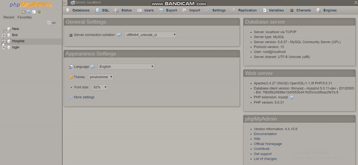
### Representing first equipments for each department with applicability of more than one report to be selected to be retrieved or made for each equipment in any department
* All reports are applicable for all equipments in any department to be made or retrieved.
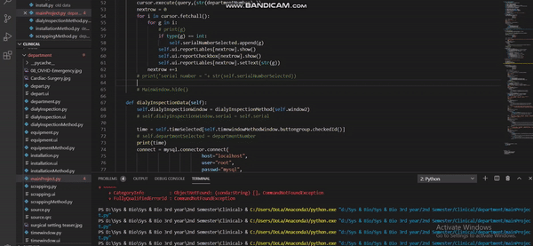
### Series steps that you can follow to add a new equipment in any department
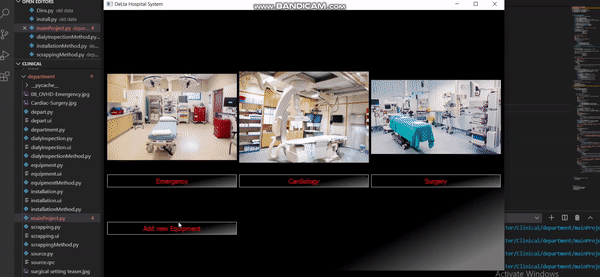
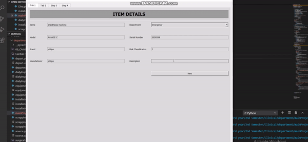
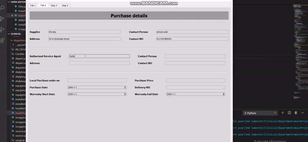
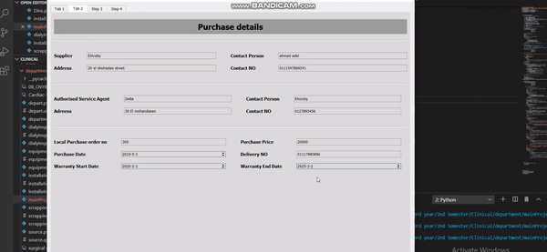
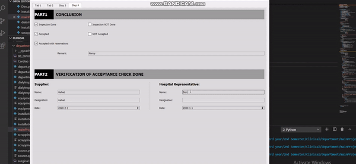
### Installation Report 
* In emergency departement.
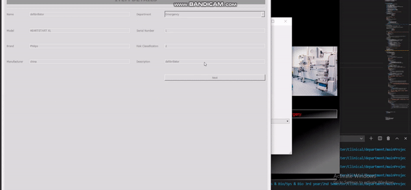
### Daily Inspection Report 
* In emergency departement.
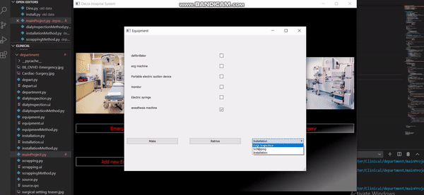
### Scrapping Report:
* In Cardiology department it also exist for emergency and surgery departement.

##  Here represinting installation report for equipment from cardiology department
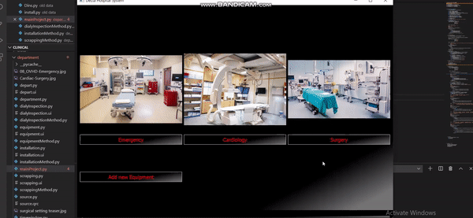
##  Here represinting all reports for any equipment from surgery department
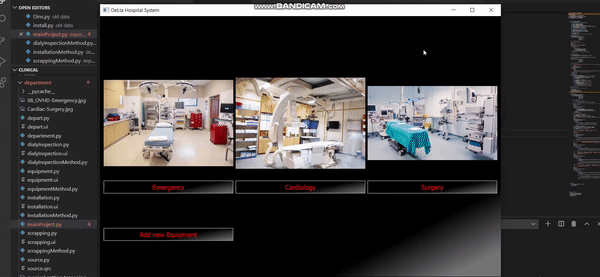
## Our Tables of data after adding new equipment through our application 
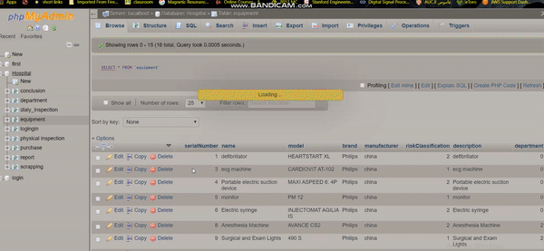
